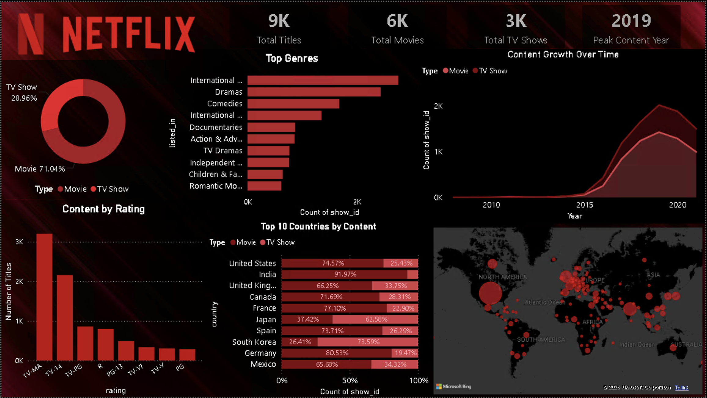
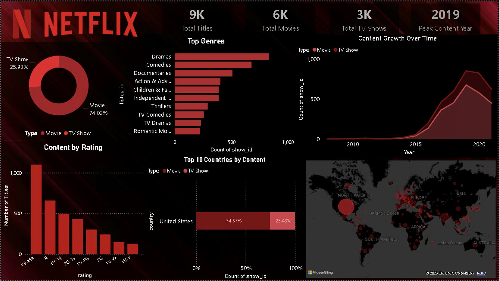
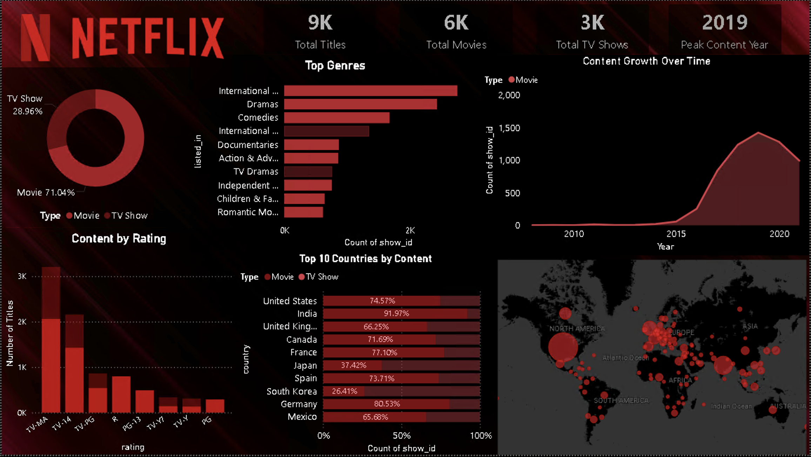

# Netflix Content Analysis (Power BI)

An exploratory analysis of Netflix's content catalogue using Power BI to understand trends in content production, genre distribution, ratings, and global availability.

---

## Dashboard Preview

### Overview


### Country Interaction


### Filtered on Movies


---

## Project Overview

This project analyses Netflix's content library to explore patterns in movies and TV shows available on the platform. The analysis focuses on understanding how Netflix's catalogue has evolved over time and identifying trends in content type, genre popularity, ratings, and geographic distribution.

The results are presented through an interactive Power BI dashboard designed to highlight key insights about Netflix’s content strategy.

---

## Dataset

Source: [Netflix Movies and TV Shows Dataset](https://www.kaggle.com/datasets/shivamb/netflix-shows)

The dataset contains information about movies and TV shows available on Netflix, including:

- show_id
- type (Movie / TV Show)
- title
- director
- cast
- country
- date_added
- release_year
- rating
- duration
- listed_in (genre)
- description

Dataset file used in this project:

```
netflix_titles.csv
```

---

## Tools Used

Power BI  
Power Query  
DAX

---

## Project Workflow

This project follows a typical data analytics workflow:

1. Data understanding and initial inspection  
2. Data cleaning and transformation (Power Query)
3. Feature engineering (DAX measures)
4. Exploratory data analysis  
5. Dashboard design and development
6. Insight generation

---

## Dashboard Features

The Power BI dashboard provides insights into:

- Total number of titles, movies and TV shows available on Netflix (KPI cards)
- Distribution of Movies vs TV Shows
- Content growth over time (trend analysis)
- Top genres by content volume
- Geographic distribution of Netflix content (map visualisation)
- Rating distribution of titles
- Top countries by content (Movies vs TV Shows split)

### Interactivity

- Cross-filtering between visuals
- Dynamic exploration by country and content type

---

## Key Insights

- Rapid growth after 2015, with peak content addition in 2019
- Movies dominate the platform (~70\% of content)
- The United States leads in total content, followed by India and the UK
- Dramas and International content are the most common genres
- Some regions (e.g., South Korea, Japan) are TV Show-heavy while others focus on movies
- Majority of content falls under TV-MA and TV-14 ratings

---

## Project Structure

```
netflix-content-analysis
├── README.md
├── netflix_titles.csv
├── netflix_dashboard.pbix
└── screenshots
    └── dashboard_country_filter.png
    └── dashboard_movie_filter.png
    └── dashboard_overview.png
    
```

---

## Future Improvements

- Add drill-through pages for deeper analysis
- Include time-based filtering (year slicers)
- Enhance storytelling with annotations
- Optimise dashboard for mobile view

---

## Author

Data Science & Business Analytics Portfolio Project
